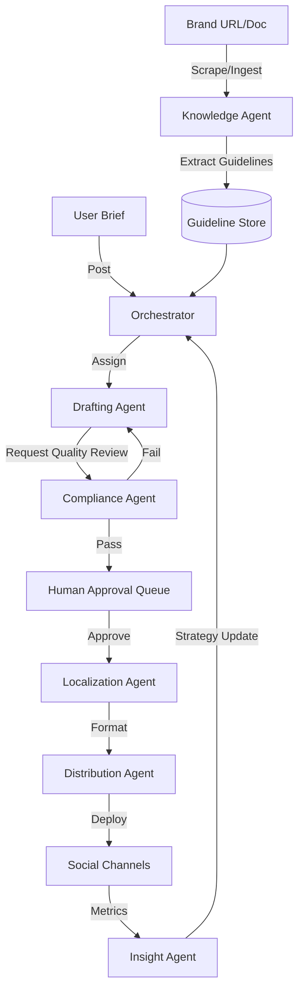

# SocialAI: Architecture Document

## 1. Overview
SocialAI is a multi-agent system designed to automate the enterprise content generation and compliance lifecycle. It utilizes a central orchestration layer to manage specialized agents, a real-time event-driven infrastructure, and a robust persistence layer to ensure transparency and reliability.

---

## 2. Agent Roles & Responsibilities

### Content Agents
- **Drafting Agent**: High-end LLMs (LLama3/Mixtral via Groq) create content based on briefs and brand guidelines.
- **Compliance Agent**: A specialized JSON-output agent that verifies content against guidelines, flagging specific terminology and tone violations.
- **Localization Agent**: Adapts content for specific regional markets (e.g., Mexico vs. Spain) while maintaining brand integrity.
- **Distribution Agent**: Formats content for social channels (e.g., Twitter, LinkedIn) with platform-specific hashtags and spacing.

### Intelligence Agents
- **Insight Agent**: Consumes engagement metrics and identifies patterns (e.g., "High video engagement on LinkedIn on Tuesdays").
- **Strategy Agent**: Proposes autonomous campaign adjustments based on insights.

### Knowledge Agents
- **Knowledge Engine**: Ingests brand DNA from any URL or source document, extracting key guidelines and terminology for zero-shot agent calibration.

---

## 3. Communication & Orchestration Layer

SocialAI uses a hybrid **REST + Socket.io** architecture:
- **REST**: For synchronous requests like health checks, asset management, and configuration.
- **Socket.io**: Powers the long-running asynchronous orchestration pipeline. This allows the backend to stream live agent status updates to the frontend and pause for **Human-in-the-Loop** approval.

---

## 4. Agent Orchestration Graph (Mermaid)

---

## 5. Tool Integrations & Infrastructure

- **Compute**: FastAPI & Python 3.12 (High concurrency for agent tasks).
- **Inference**: Groq API (Sub-second inference for Llama 3) for rapid agent response.
- **Persistence**: SQLAlchemy + SQLite (Tracks every agent step and activity log).
- **UI**: Next.js 14 (Real-time dashboard using Socket.io client).

---

## 6. Error Handling & Reliability

- **Graceful Fallbacks**: When agent parsing fails (e.g., invalid JSON from an LLM), the system utilizes regex-based extraction to recover or defaults to a safe "Human Review required" state.
- **Activity Logging**: Every agent step is persisted to the database, allowing for a complete audit trail if a workflow fails.
- **Human Guidance**: The pipeline is designed around a "Co-pilot" model where the final distribution requires an explicit human socket event.
